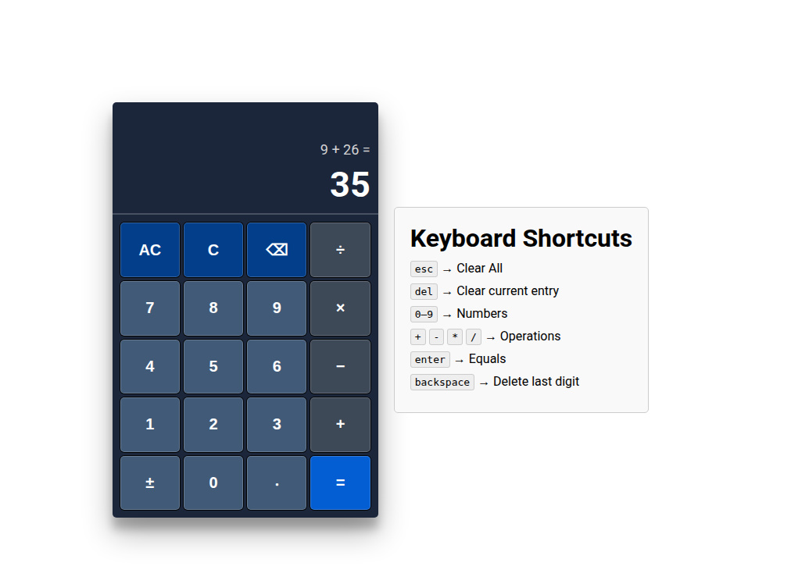

# Calculator

This project is a basic calculator from The Odin Project's Foundations Course. It allows users to perform simple mathematical operations such as addition, subtraction, multiplication, and division. The calculator also supports keyboard input for convenience.

## Features
- Perform addition, subtraction, multiplication, and division
- Clear and delete functions
- Keyboard input support (e.g. 'Esc' to clear, 'Backspace' to delete, 'Enter' to calculate)

## Demo
[Live demo](https://cwjr-dev.github.io/calculator/)